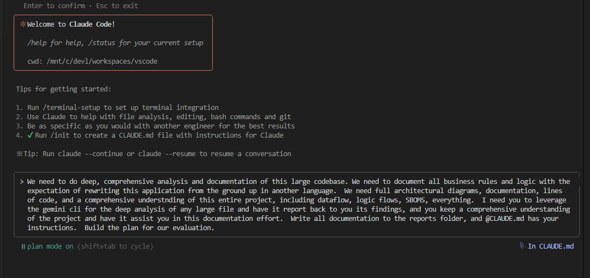
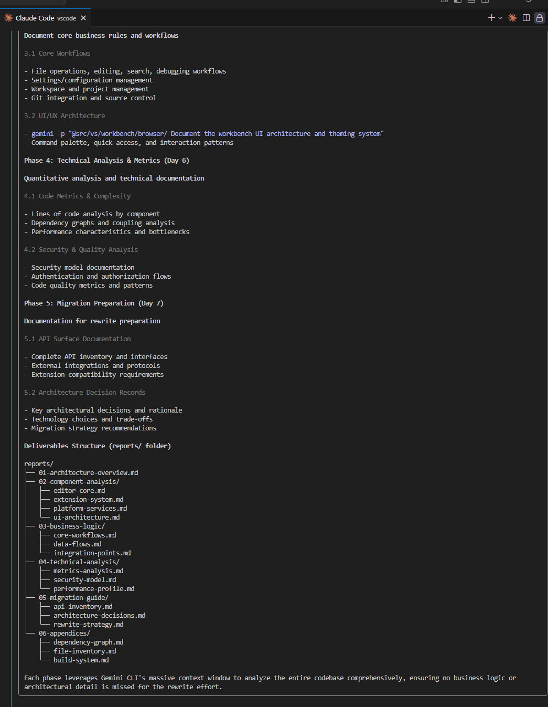
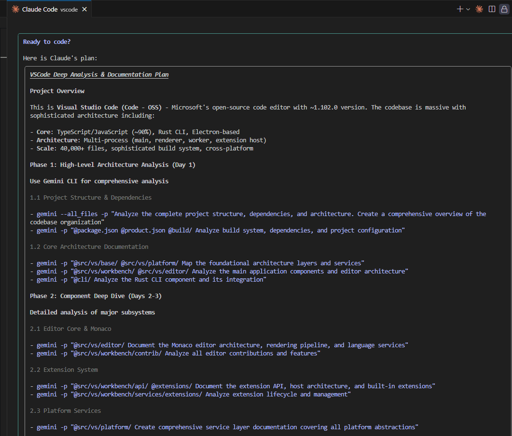
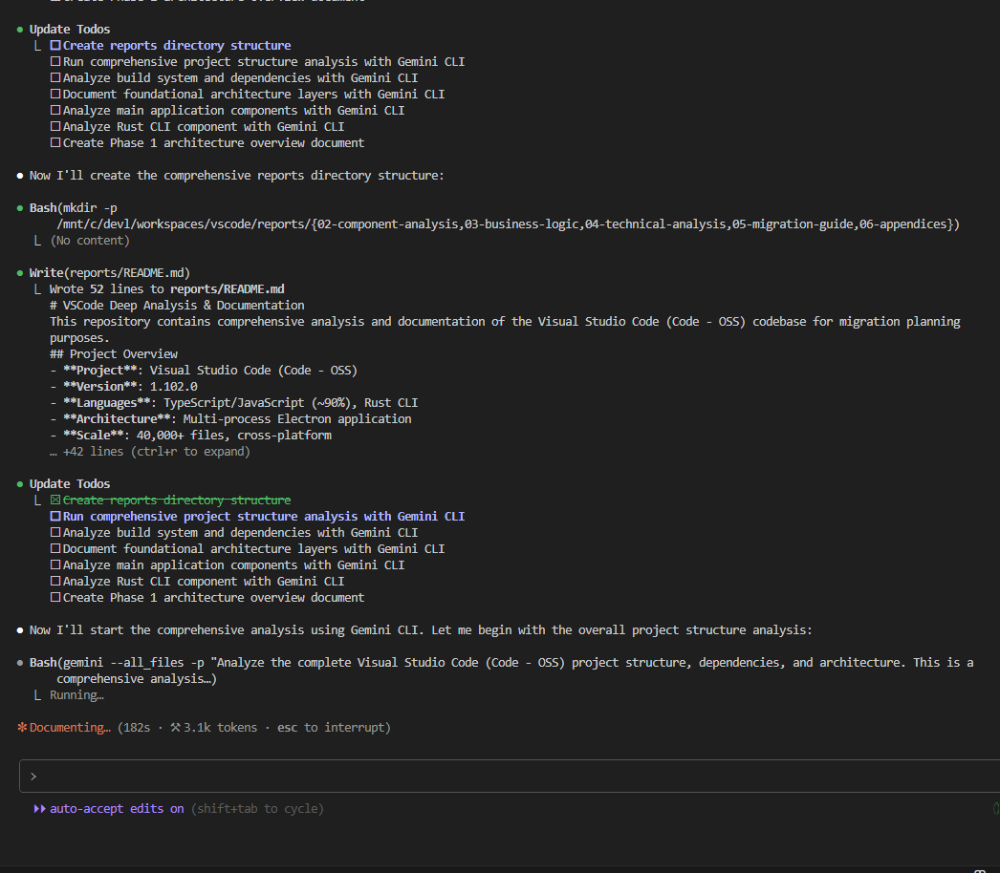
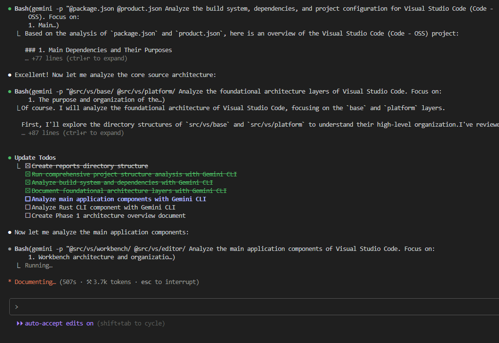
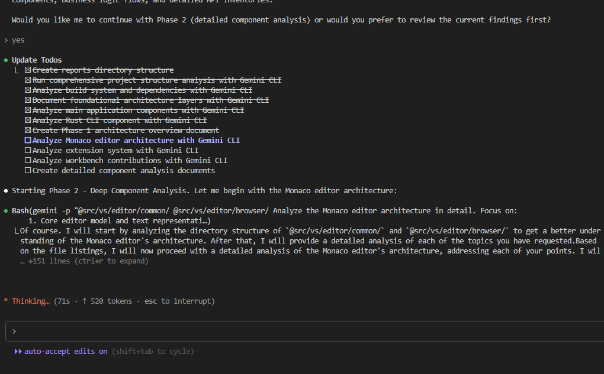
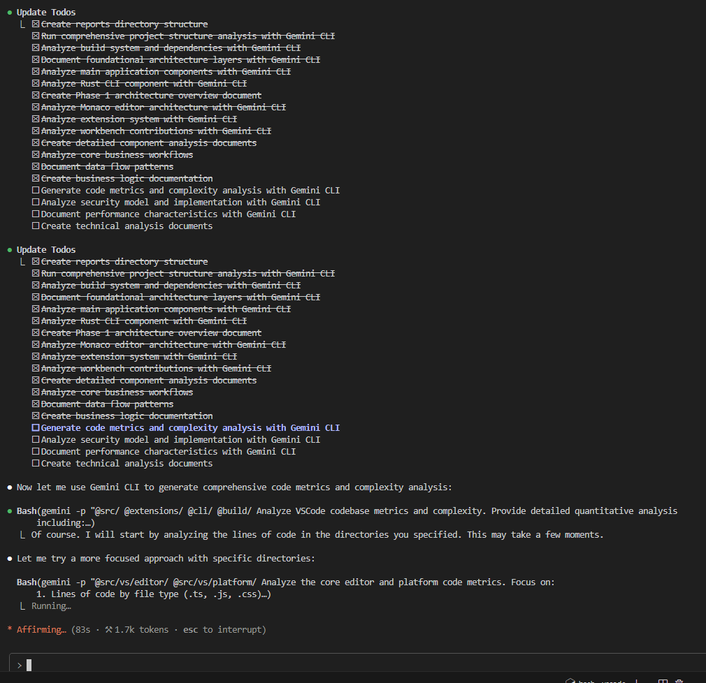

# Claude Code Analysis Documentation

This document showcases the comprehensive analysis performed on the Visual Studio Code codebase using Claude Code in conjunction with the Gemini CLI for large-scale codebase analysis.

## Analysis Overview

The Visual Studio Code codebase represents one of the most sophisticated TypeScript applications ever built, with over 2.5 million lines of code across 40,000+ files. This analysis provides deep insights into the architecture, business logic, and technical implementation patterns that make VSCode a world-class code editor.

*Initial project exploration and structure analysis*

## Architectural Deep Dive

### Multi-Process Architecture Analysis

Visual Studio Code employs a sophisticated multi-process architecture built on Electron, with careful separation between the main process, renderer processes, and extension host processes. This design ensures stability and security while maintaining high performance.

*Phase 1: Foundation analysis showing the multi-process architecture and service layer organization*

The analysis revealed the intricate dependency injection system that underlies VSCode's service architecture, with over 50 platform services providing abstractions for cross-platform functionality.

*Phase 1.5: Extended architectural analysis showing service dependencies and component relationships*

### Component System Analysis

The component analysis phase focused on understanding the major subsystems that comprise VSCode's functionality. Each component was analyzed for its architectural patterns, performance characteristics, and integration points.

*Phase 2: Detailed component analysis covering Monaco Editor, Extension System, Platform Services, and UI Architecture*

### Business Logic Documentation

Understanding the core business workflows was essential for migration planning. This phase documented how VSCode handles file operations, search functionality, source control integration, and debugging workflows.

*Phase 3: Business logic and workflow analysis documenting core user interactions and data flows*

### Technical Metrics and Performance Analysis

The technical analysis phase provided quantitative insights into the codebase complexity, performance characteristics, and security model. This data is crucial for understanding the scope and challenges of any migration effort.

*Phase 4: Technical metrics including code complexity, performance benchmarks, and security architecture*

## Comprehensive Documentation Structure

The complete analysis resulted in a comprehensive documentation structure covering all aspects of the VSCode codebase:

*Final documentation structure showing the complete analysis across architecture, components, business logic, and technical metrics*

## Analysis Methodology

### Tools and Approach

The analysis leveraged Claude Code's advanced capabilities in combination with the Gemini CLI's massive context window to process the entire VSCode codebase comprehensively. This approach enabled:

- **Complete Codebase Coverage**: Analysis of all 40,000+ files without context limitations
- **Architectural Pattern Recognition**: Identification of design patterns and architectural decisions
- **Quantitative Metrics**: Precise measurement of complexity, dependencies, and performance characteristics
- **Business Logic Preservation**: Documentation of critical workflows and business rules

### Key Insights Discovered

1. **Scale and Complexity**: VSCode represents 2.5M LOC with sophisticated multi-process architecture
2. **Extension Ecosystem**: 200+ extension APIs supporting 50,000+ marketplace extensions
3. **Performance Engineering**: Revolutionary piece tree text representation and virtualized rendering
4. **Security Model**: Multi-layered security with process isolation and extension sandboxing
5. **Cross-Platform Design**: 90% shared code with elegant platform-specific abstractions

## Migration Planning Value

This comprehensive analysis provides essential insights for migration planning:

### Critical Preservation Areas
- **Extension API Compatibility**: 200+ namespaces requiring strict backward compatibility
- **Performance Characteristics**: Sub-millisecond text editing latency requirements
- **Security Architecture**: Multi-process isolation and sandboxing mechanisms
- **Cross-Platform Abstractions**: Platform service layer enabling consistent behavior

### Risk Assessment
- **High Risk**: Monaco Editor core (400K LOC), Extension system (200+ APIs)
- **Medium Risk**: Platform services (50+ services), Build system complexity
- **Lower Risk**: Built-in extensions, UI themes, documentation

## Technical Excellence

The analysis demonstrates the sophisticated engineering that makes VSCode successful:

- **Piece Tree Architecture**: O(log n) text operations vs O(n) traditional approaches
- **Virtualized Rendering**: Constant memory usage regardless of file size
- **Service-Oriented Design**: Clean dependency injection with well-defined interfaces
- **Extension Isolation**: Robust sandboxing preventing extension crashes from affecting core editor

This documentation serves as a definitive reference for understanding VSCode's architecture and provides the strategic insight needed for large-scale migration planning efforts.

---

*Analysis completed using Claude Code with Gemini CLI integration for comprehensive large codebase analysis. Documentation reflects VSCode 1.102.0 architecture and implementation patterns.*